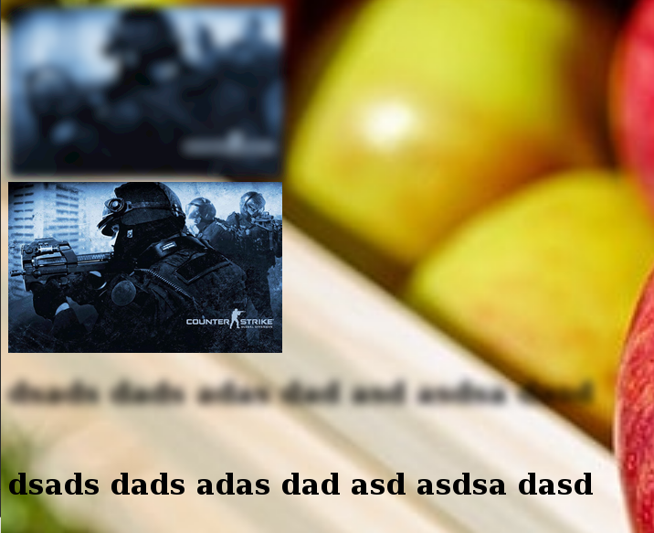

# Example of blur.js

blur.js is a javascript library for blurring HTML content with CSS and SVG

<a href="https://argenisosorio.github.io/blur_js_example/">Demo</a>

<a href="https://github.com/jakiestfu/Blur.js-II">Based on Blur.js-II</a>
